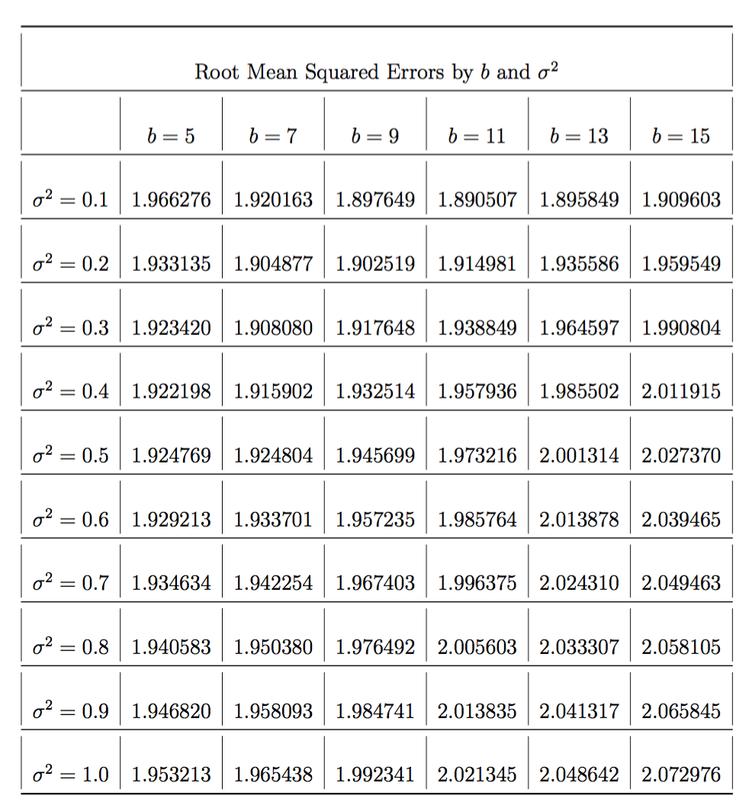
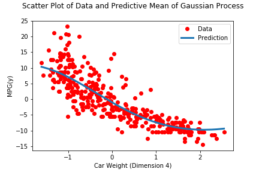

# Gaussian_Process
Implement the Gaussian process model for regression from scratch

The Gaussian process treats a set of N observations $(x_1, y_1), . . . , (x_N , y_N)$, with $x_i ∈ R^d$ and $y_i ∈ R$, as being generated from a multivariate Gaussian distribution as follows,
$y∼Normal(0, σ^2I + K), K_{ij} =K(x_i,x_j)$  
I will be using the RBF Kernel: $exp^{−1/b ∥x_i−x_j∥^2}$

## Data

The data is broken into training and testing sets. Each row in both “X” files contain six features for a single car (plus a 1 in the 7th dimension) and the same row in the corresponding “y” file contains the miles per gallon for that car.

## Technology Used
- Python 3

## Some Results

The best root mean squared error value was 1.890507, which occurred when b was 11 and σ2 was 0.1. This was better than the root mean squared error observed in the Ridge Regression Implementation, which was greater than 2.1. The drawbacks of this approach include computation time and scalability. It takes longer than the Regression approach. This approach is not scalable as the number of data points increases. This is mostly due to the fact that we must take the inverse of an n × n matrix which can be very slow or even unfeasible for very large n. We also need the storage space to store an n × n matrix and if we have too many data points (n is very large), this may not even fit into RAM. We would also have to figure out two parameters with this approach, σ2 and b, and the more pairs we try, the more computation and time necessary. In this implementation, we are using the rbf kernel which is essentially a mapping into infinite dimensional space. We know from general polynomial expansion that we may overfit. One concluding thought is that with ridge regression, we learned weights on the features and thus we could gain extra information and see how much each feature contributes to the model, something we can’t see as well with the gaussian process.

